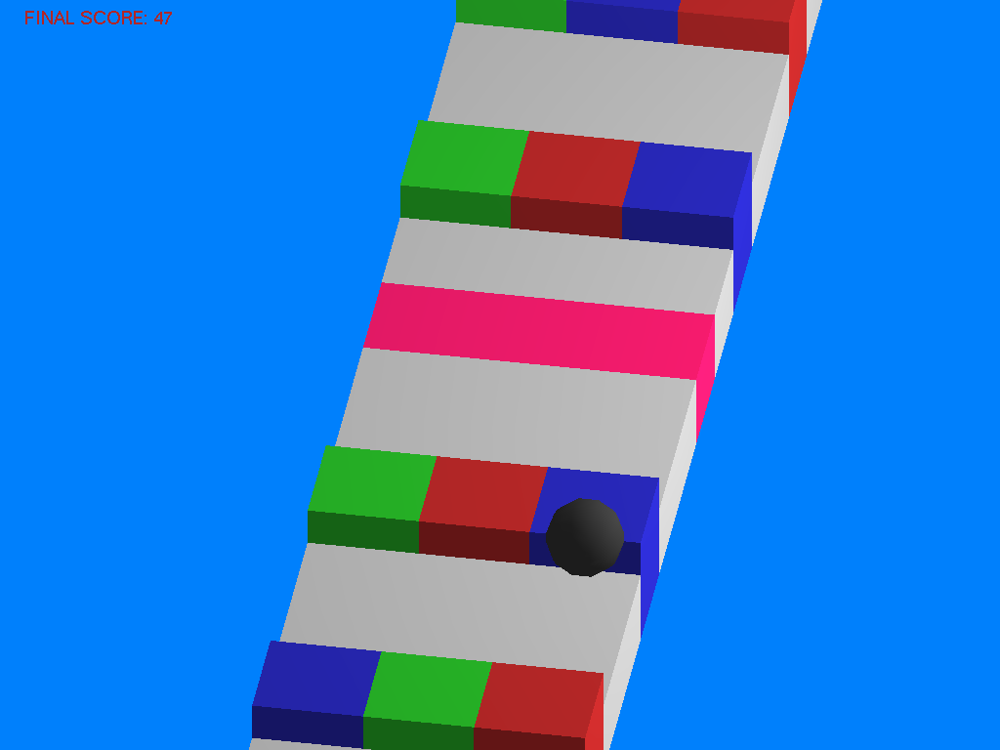
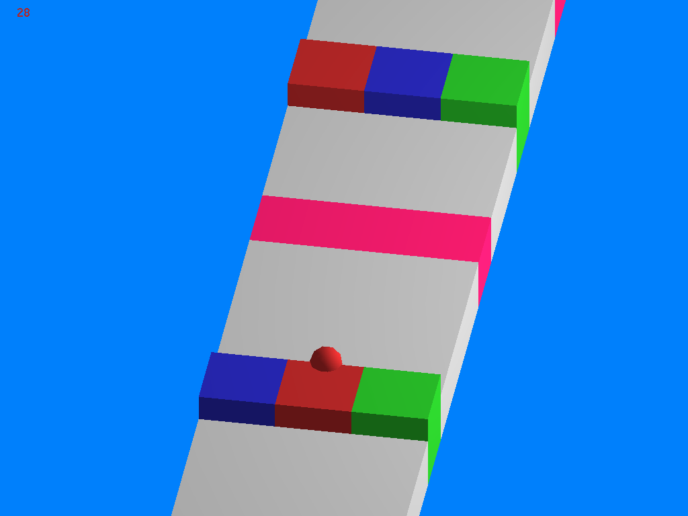
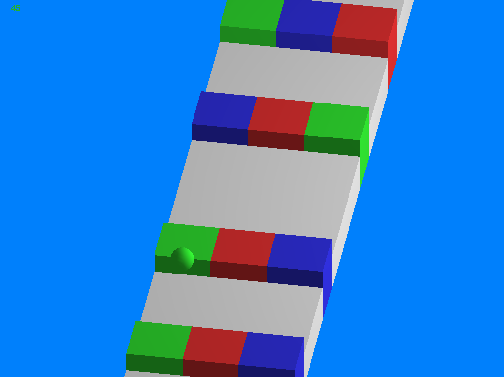

# Colorunner

Colorunner je jednostavna igrica napravljena koristeći OpenGl biblioteku, za potrebe kursa Računarska Grafika na Matematičkom fakultetu, 2018 godine.

## Kratka pravila

Igrač kontroliše lopticu koja se kreće stazom. Loptica se može kretati levo ili desno. Loptica može biti određene boje
(crvena, zelena ili plava), i kada se pojave obojene prepreke loptica moze proći samo kroz prepreku koja je iste boje.
Takođe, može se pojaviti i roze polje, i loptica će promeniti boju i nastaviti da se kreće normalno kada pređe preko njega. 
Cilj igre je da igrač što duže uspešno kontroliše lopticu i pazi da ne padne sa platforme ili prođe kroz prepreku pogrešne boje.

### Kontrole

 * Strelica levo - Kretanje loptice levo.
 * Strelica desno - Kretanje loptice desno.
 * 'P' ili 'p' - Pauza/Izlazak iz pauze.
 * 'Q' ili 'q' - Izlazak iz igre.

## Instalacija i pokretanje igre

Instalacija i pokretanje igre su prilično jednostavni. Potrebno je otvoriti terminal, pozicionirati se na datoteku sa fajlovima i uneti komandu:

```
make
```

Nakon toga, igra se startuje komandom: 

```
./colorunner
```

## Nekoliko slika iz same igre

Loptica je prošla kroz prepreku drugačije boje - Kraj igre


Loptica je prošla kroz prepreku iste broje i nastavlja dalje. Nakon toga će stati na roze polje, što će izmeniti njenu boju.


Loptica se kreće uspešno.

